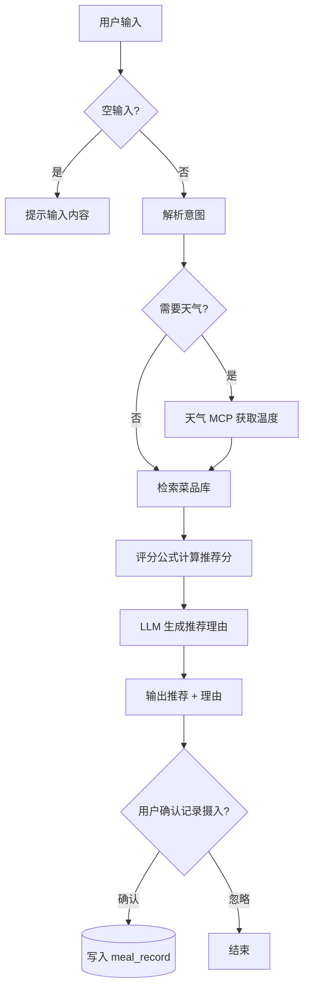
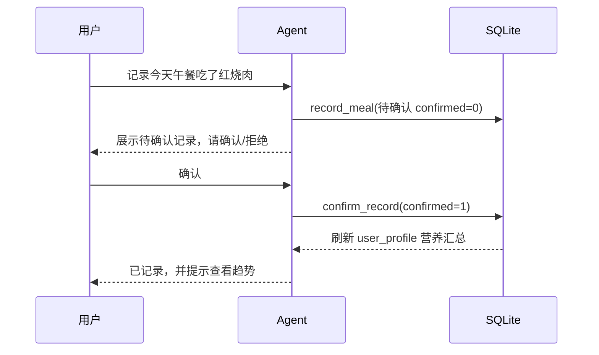
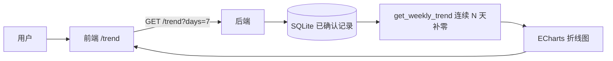
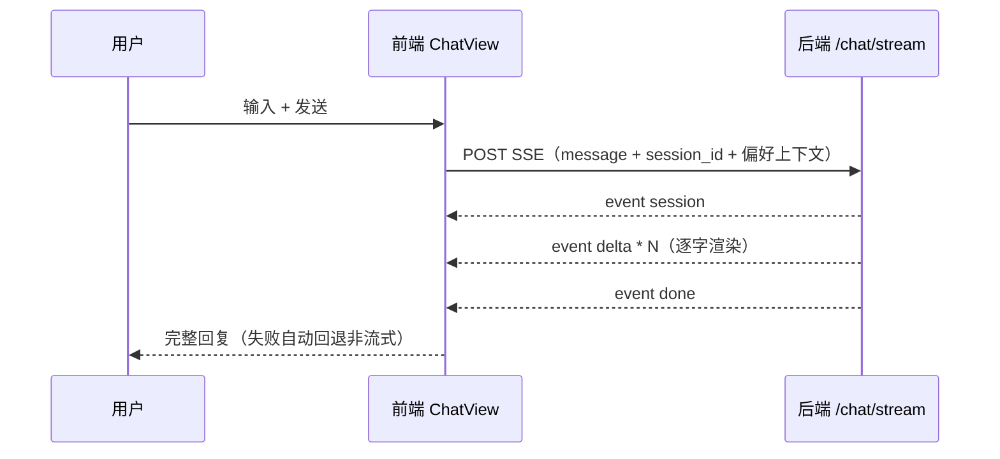

# 食堂菜品推荐与营养分析 Agent — 分析文档（ANALYSIS）

> 版本：v1.0　|　日期：2026-08-03　|　维护：C（整合 A/B 素材）
> 输入：`docs/项目需求.md`（FR/NFR）、`docs/项目选题.md`
> 本文件聚焦：需求分析、典型用例、核心流程图，供开发与答辩使用。

---

## 1. 需求分析

### 1.1 功能需求（FR）与优先级

| 编号 | 功能 | 优先级 | 实现途径 |
|------|------|--------|----------|
| FR-01 | 菜品营养查询（按菜名/关键词） | P0 | Agent `search_dish` 工具 |
| FR-02 | 营养库 ≥50 道菜、注明来源 | P0 | A：`dishes.csv`（54 道） |
| FR-03 | 菜单 ≥5天×3餐 结构化入库 | P0 | A：`menu.csv` |
| FR-04 | 推荐评分（预算/营养/偏好权重） | P0 | 自研 `scoring.py` |
| FR-05 | 推荐理由生成 | P0 | LLM 基于评分分项生成 |
| FR-06 | 多日饮食追踪（天/周趋势） | P1 | `record.py` + `get_weekly_trend` + 前端 ECharts |
| FR-07 | 搭配优化子 Agent（预算+热量上限） | P1 | `optimizer.py` 二维背包 + 子 Agent |
| FR-08 | 天气 MCP 推荐（天冷热汤/天热清淡） | P2 | `mcp/` 天气 MCP（mock 回退） |

### 1.2 非功能需求（NFR）落点

| 编号 | 需求 | 落点 |
|------|------|------|
| NFR-01 | 空输入/异常友好反馈 | 前端拦截 + 后端友好文案 |
| NFR-02 | 多轮记忆、会话隔离 | `SessionStore`（TTL+上限）+ `session_id` |
| NFR-03 | 密钥 `../backend/.env` 管理 | `.env.example`，不入镜像 |
| NFR-04 | 日志/耗时/Token 中间件 | `RequestMetricsMiddleware` + `/metrics` |
| NFR-05 | 工具异常可恢复 | `safe_tool` 兜底包装 |
| NFR-06 | 数据来源合规 | 菜品 `source` 字段 + 清洗记录 |

---

## 2. 用例（UC）

### UC-01 查询菜品营养
- **触发**：用户输入"查一下红烧肉"
- **流程**：Agent 识别意图 → `search_dish("红烧肉")` → 返回营养字段
- **主成功**：展示热量/蛋白/碳水/脂肪/价格/来源
- **扩展**：无匹配 → "未找到，是否想找近似菜品"（`retrieve_dishes` RAG 模糊召回）

### UC-02 按预算与健康目标推荐
- **触发**：用户输入"10块钱预算推荐几个菜" 或 画像已保存
- **流程**：读取画像（预算/口味/目标）→ `recommend`（预算硬过滤 + 评分公式）→ LLM 生成理由
- **主成功**：返回 Top-K + 理由（如"蛋白质达标且不超过预算"）
- **扩展**：预算过小无解 → 提示最低预算区间

### UC-03 记录一餐摄入（HITL 审批）
- **触发**：用户输入"记录今天午餐吃了红烧肉"
- **流程**：`record_meal` 写入待确认 → 展示给用户确认 → `confirm_record` 生效
- **主成功**：确认后刷新 `user_profile` 营养汇总
- **扩展**：拒绝 → `reject_record`，不参与聚合

### UC-04 查看营养趋势
- **触发**：用户输入"最近7天营养摄入趋势" 或打开 `/trend` 页
- **流程**：`get_weekly_trend`（连续 N 天补零）→ 前端 ECharts 折线图
- **主成功**：按天展示热量/蛋白/碳水/脂肪曲线

### UC-05 组合优化一餐
- **触发**：用户输入"预算20元、热量800卡以内配一餐"
- **流程**：`optimize_meal_tool`（01 背包 + 荤素搭配修正）→ 返回搭配与营养汇总
- **扩展**：无解 → 放宽约束提示

### UC-06 按天气推荐
- **触发**：用户输入"今天吃什么"（天气 MCP 介入）
- **流程**：天气 MCP 取温度 → 低温推热汤炖菜、高温推清淡凉菜 → 融合推荐
- **回退**：无 API key 时用 mock 天气源

---

## 3. 核心流程图

### 3.1 推荐主流程

### 3.2 记录摄入（HITL）流程

### 3.3 营养趋势流程

### 3.4 前端流式对话流程

---

## 4. 技术风险与应对（答辩要点）

| 风险 | 应对 |
|------|------|
| 本地模型 function calling 不稳定 | 选 qwen2.5/llama3.1；预留云端 API 切换 |
| LLM 推理慢/显存不足 | 7B 量化模型 + Docker 模型卷避免重复拉取 |
| 真天气 API 注册/配额 | 默认 mock 天气源，真实 API 作开关 |
| 前端占用时间挤压核心 | 契约先行并行开发，进度失控退 Gradio 兜底 |
| 多服务集成点 | 每晚集成 main，禁止超 1 天不合并 |