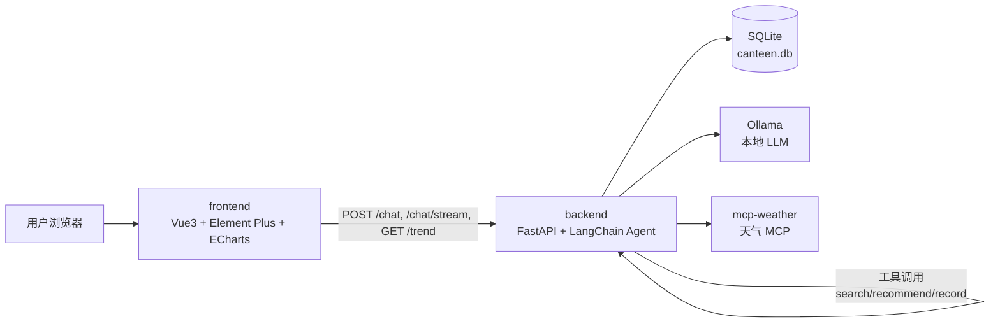
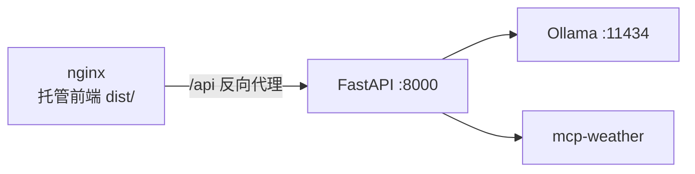

# 食堂菜品推荐与营养分析 Agent — 设计文档（DESIGN）

> 版本：v1.0　|　日期：2026-08-03　|　维护：C（架构整合）
> 对应实现：`frontend/`（Vue3）、`backend/`（FastAPI + Agent）、`docker/`
> 需求来源：`docs/项目需求.md`　·　选型依据：`docs/技术选型.md`

---

## 1. 系统架构



- `frontend`：三层页面（聊天 / 营养趋势 / 我的偏好），经 REST + SSE 与后端交互
- `backend`：FastAPI 出口 + Agent 工具循环，工具层（search/score/optimize/record/weather）自研
- `data`：SQLite 单库（dish/menu/meal_record/user_profile），数据访问薄封装可换 MySQL
- `llm`：Ollama 本地模型，支持切云端 OpenAI 兼容 API

## 2. 前端模块说明（C 负责）

### 2.1 页面路由

| 路由 | 视图 | 说明 |
|------|------|------|
| `/` | `ChatView` | 对话聊天：流式输出、会话持久化、偏好注入、错误兜底 |
| `/trend` | `TrendView` | ECharts 折线图：近 7/14/30 天每日营养摄入趋势 |
| `/profile` | `ProfileView` | 预算/口味/健康目标表单，保存到 localStorage 并注入对话 |

### 2.2 组件与模块

| 模块 | 文件 | 职责 |
|------|------|------|
| API 客户端 | `src/api/client.ts` | axios 实例，`VITE_API_BASE` 配置 |
| 聊天 API | `src/api/chat.ts` | `/chat` 非流式 + `/chat/stream` SSE 解析 |
| 趋势 API | `src/api/trend.ts` | `GET /trend` 结构化趋势数据 |
| 类型契约 | `src/types/chat.ts` | 与后端契约对应的 TS 类型 |
| 路由 | `src/router/index.ts` | 三页路由 |
| 结果卡片 | `src/components/DishCard.vue` | 菜品卡片（价格/热量/蛋白质/碳水/脂肪） |
| 偏好表单 | `src/components/ProfileForm.vue` | 预算/口味/目标设置与持久化 |
| 全局布局 | `src/App.vue` | 顶部导航 + RouterView |

### 2.3 关键交互流程

#### 聊天（流式）
```
用户输入 → 校验非空 → 注入用户偏好上下文
  → POST /chat/stream（SSE：session → delta* → done）
  → 逐字渲染 assistant 气泡 → session_id 存 localStorage
失败回退：流式失败 → POST /chat（非流式）→ 再失败 → 友好错误提示
用户可点「停止」中断（AbortController），保留已输出内容
```

#### 营养趋势
```
进入 /trend → GET /trend?days=7&end_date=today → ECharts 渲染
切换天数 → 重新拉取；缺失日期后端补零，图表连续
```

#### 偏好注入
```
表单保存 → localStorage('canteen.profile')
聊天发送时读取 → 生成"（用户偏好：预算20元，口味清淡，目标控油）"+ 原文
```

## 3. 后端接口（前端依赖）

| 方法 | 路径 | 说明 |
|------|------|------|
| GET | `/health` | 健康检查 |
| POST | `/chat` | 对话（非流式），`{message, session_id?}` → `{reply, session_id}` |
| POST | `/chat/stream` | 对话（SSE：`session`/`delta`/`done`） |
| GET | `/trend` | 营养趋势：`days`(默认7)、`end_date`(可选) → 连续 N 天每日营养合计 |
| GET | `/metrics` | 中间件统计（请求数/耗时/Token） |

> `GET /trend` 由 C 补充（D4），使用 A 的 `db.get_weekly_trend()`，缺失日期补零。
> 完整契约见 `docs/BC-API文档.md`。

## 4. 数据模型（前端视角）

菜品（dish）：`name, calories, protein, carbs, fat, price, category, flavor_tags, source`
趋势点（trend point）：`date, total_calories, total_protein, total_carbs, total_fat, dish_count`
用户画像（profile）：`budget, flavor_preferences, health_goals`

## 5. 部署拓扑



见 `docs/DEPLOY.md` 与 `docker/docker-compose.yml`。
