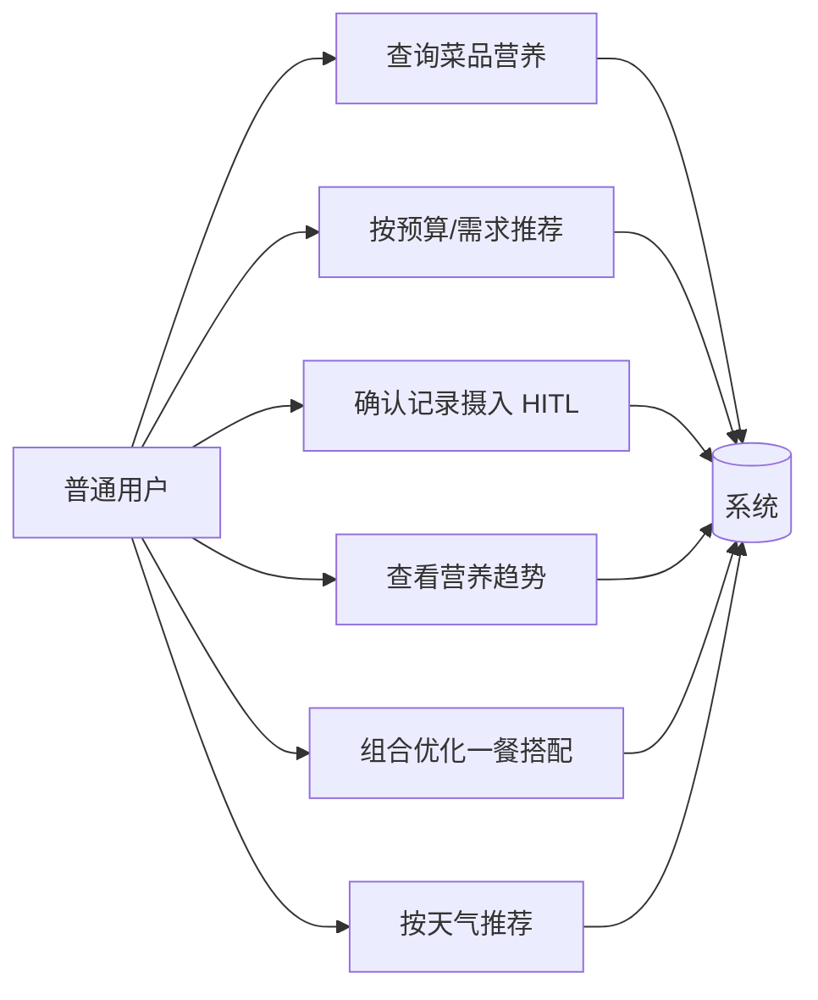
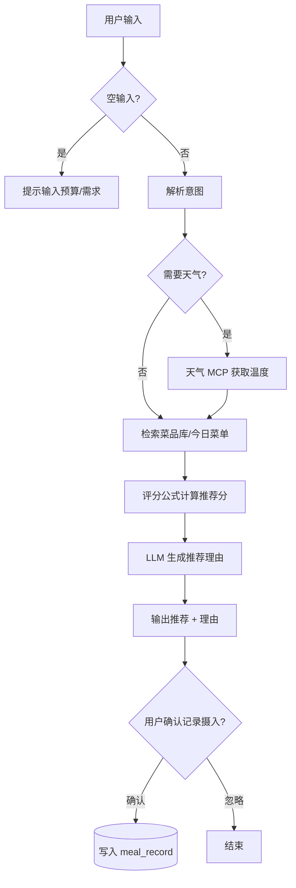
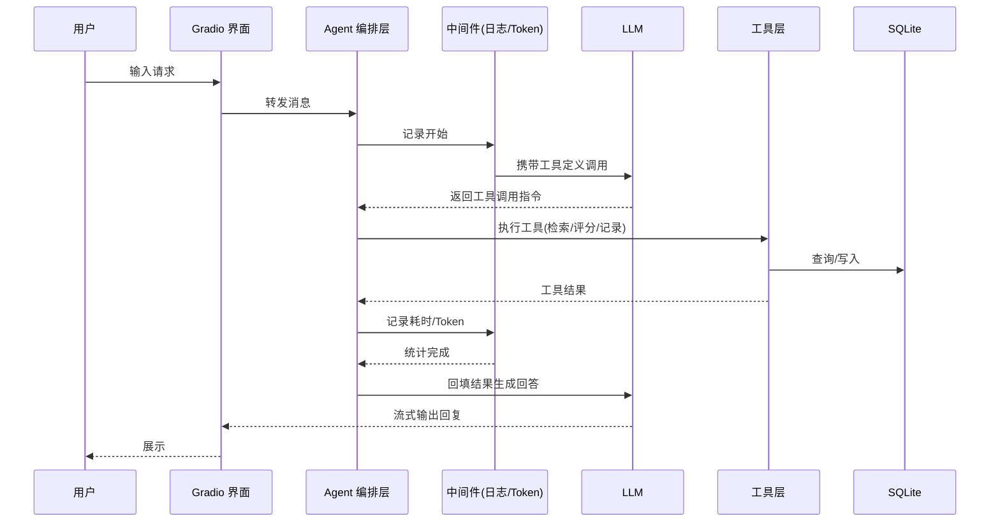

# 食堂菜品推荐与营养分析 Agent — 项目需求

> 版本：v1.0　|　日期：2026-08-01　|　状态：初稿
> 本文档基于《项目选题.md》与《评分标准.md》整理，作为开发、测试与答辩的输入。

---

## 1. 项目概述

构建一个"食堂点餐参谋"智能助手（LLM Agent），面向食堂就餐场景，提供三类核心能力：

1. **查**：查询菜品营养信息（热量、蛋白质、碳水、脂肪）。
2. **荐**：按用户预算与营养需求，推荐荤素搭配合理的一餐，并给出推荐理由。
3. **追踪**：记录多日每餐摄入，按天、按周输出营养摄入趋势。

目标用户为**在校学生 / 食堂常驻就餐人员**，操作方式为对话式交互（聊天界面）。

---

## 2. 干系人与用户角色

| 角色 | 描述 | 使用方式 |
|---|---|---|
| 普通用户（就餐者） | 查询菜品、获取推荐、记录并查看营养摄入 | 聊天界面 |
| 系统管理员（开发者） | 维护菜品库、菜单、评分系数、查看运行日志与 Token 统计 | 后台/命令行 |

> 单用户为主，不涉及复杂权限体系；"管理员"即开发团队自身，用于数据维护与调试。

---

## 3. 功能性需求

### 3.1 功能需求总表（FR）

| 编号 | 功能 | 描述 | 优先级 | 对应评分档 |
|---|---|---|---|---|
| FR-01 | 菜品营养查询 | 按菜名/关键词查询菜品，返回热量、蛋白质、碳水、脂肪及数据来源 | 基本 | 及格/中等 |
| FR-02 | 营养库建设 | ≥50 道菜，字段含热量、蛋白质、碳水、脂肪，注明参考来源 | 基本 | 及格 |
| FR-03 | 菜单采集入库 | 收集 ≥5天×3餐 食堂菜单，结构化入库 | 基本 | 及格 |
| FR-04 | 推荐评分 | 按预算约束、营养均衡、偏好权重计算推荐分，返回推荐结果 | 基本 | 中等/良好 |
| FR-05 | 推荐理由生成 | 推荐结果附理由，如"蛋白质达标且不超过预算" | 基本 | 中等 |
| FR-06 | 多日饮食追踪 | 记录每餐摄入，按天、按周输出营养摄入趋势 | 进阶 | 良好/优秀 |
| FR-07 | 搭配优化子 Agent | 给定预算与热量上限，用组合算法求最优一餐搭配 | 进阶 | 良好/优秀 |
| FR-08 | 天气 MCP 接入 | 天冷推荐热汤面类，天热推荐清淡类 | 进阶 | 优秀 |

### 3.2 功能优先级

- **P0（必须，保底）**：FR-01、FR-02、FR-03、FR-04、FR-05
- **P1（重要）**：FR-06、FR-07
- **P2（亮点）**：FR-08

---

## 4. 非功能性需求（NFR）

| 编号 | 类别 | 需求 |
|---|---|---|
| NFR-01 | 可用性 | 空输入给提示；工具/LLM 异常给友好反馈，不直接抛 traceback |
| NFR-02 | 对话能力 | 多轮对话有记忆；支持会话历史、多会话隔离 |
| NFR-03 | 安全 | API 密钥通过 `.env` 管理，不入库、不提交 |
| NFR-04 | 可观测 | 中间件记录请求日志、耗时、Token 统计 |
| NFR-05 | 健壮性 | 超出能力范围如实说明；工具异常可恢复；演示有兜底 |
| NFR-06 | 合规 | 营养数据注明参考来源，保留数据清洗记录 |
| NFR-07 | 可维护 | 文档齐全（README/DESIGN/REQUIREMENTS/ANALYSIS/DEPLOY/SUMMARY） |

---

## 5. 用例分析

### 5.1 用例图

### 5.2 用例详情（主流程 + 扩展）

#### UC-01 查询菜品营养
- **前置**：菜品库已初始化（≥50 道菜）
- **主流程**：
  1. 用户输入菜名/关键词（如"红烧肉"）
  2. Agent 调用菜品检索工具，返回营养信息
  3. 系统展示热量、蛋白质、碳水、脂肪及数据来源
- **扩展**：菜名不存在 → 返回"未找到，是否想找近似菜品？"并给出候选

#### UC-02 按预算与需求推荐
- **前置**：用户提供预算（和/或营养目标，如"高蛋白""控油"）
- **主流程**：
  1. 系统读取用户偏好（预算、口味、忌口）
  2. 调用推荐评分工具，按评分公式对候选菜打分
  3. 返回荤素搭配推荐 + 理由（如"蛋白质达标且不超过预算"）
- **扩展**：预算过小无解 → 提示最低预算区间，给出最接近方案

#### UC-03 记录每餐摄入（HITL 审批）
- **主流程**：
  1. 系统生成"今日午餐：菜品 A/B/C"的记录建议
  2. **用户确认后才写入**摄入记录表（人工审批环节）
  3. 写入成功提示
- **扩展**：用户拒绝 → 放弃写入，可手动修改菜品

#### UC-04 查看营养趋势
- **主流程**：用户请求"近 7 天营养"→ 系统聚合 `meal_record` 数据 → 输出按天/按周趋势图与汇总

#### UC-05 组合优化一餐搭配
- **主流程**：用户给出预算 + 热量上限 → 搭配优化子 Agent 用组合算法（背包/动态规划）求最优一餐 → 返回搭配与营养汇总
- **扩展**：无可行解 → 放宽约束提示

#### UC-06 按天气推荐
- **主流程**：系统通过天气 MCP 获取温度 → 低温推荐热汤面类、高温推荐清淡类 → 与常规推荐融合输出

---

## 6. 业务流程（流程图）

### 6.1 推荐主流程

### 6.2 Agent 工具调用链路

---

## 7. 数据需求

| 数据实体 | 关键字段 | 来源 | 规模 |
|---|---|---|---|
| 菜品（dish） | 名称、热量、蛋白质、碳水、脂肪、价格、口味标签、荤素类别、参考来源 | 《中国食物成分表》/公开营养数据 | ≥50 条 |
| 菜单（menu） | 日期、餐次、菜品 ID 列表 | 食堂实际菜单采集 | ≥5天×3餐 |
| 摄入记录（meal_record） | 日期、餐次、菜品、份量 | 用户确认后写入 | 随使用增长 |
| 用户画像（user_profile） | 预算、口味偏好、忌口、历史营养汇总 | 用户提供 + 系统累积 | 每用户 1 条 |

> **数据质量要求**：每条菜品营养数据必须注明参考来源；采集过程保留清洗记录（去除重复、统一单位、缺失值处理），作为文档与答辩依据。

---

## 8. 验收标准（对照评分标准）

| 档位 | 验收要点 | 本需求对应项 |
|---|---|---|
| 及格 | Agent 链路通、≥1 自写工具、README + .env.example + 5 组测试 | FR-01~03，NFR-03 |
| 中等 | 核心功能全、UI、不崩、多轮记忆、≥2 工具 | FR-04~05，NFR-01~02 |
| 良好 | ≥3 工具、HITL 审批、中间件、数据清洗记录、边界处理 | FR-06，UC-03，NFR-04/05 |
| 优秀 | 子 Agent 或 MCP、Store 长期记忆、Token 统计、Skill 文档、流式/会话隔离 | FR-07~08，NFR-02/04 |

---

## 9. 范围与约束

- **范围外**：不做真实下单/支付、不做多食堂跨库、不做复杂推荐算法（深度学习）调优。
- **技术约束**：LLM 采用 OpenAI 兼容 API；工具与 RAG 链路自研；密钥走 `.env`。
- **时间约束**：1 周内冲刺"优秀"档，采用三线并行开发（数据/Agent/前端），每日集成。
